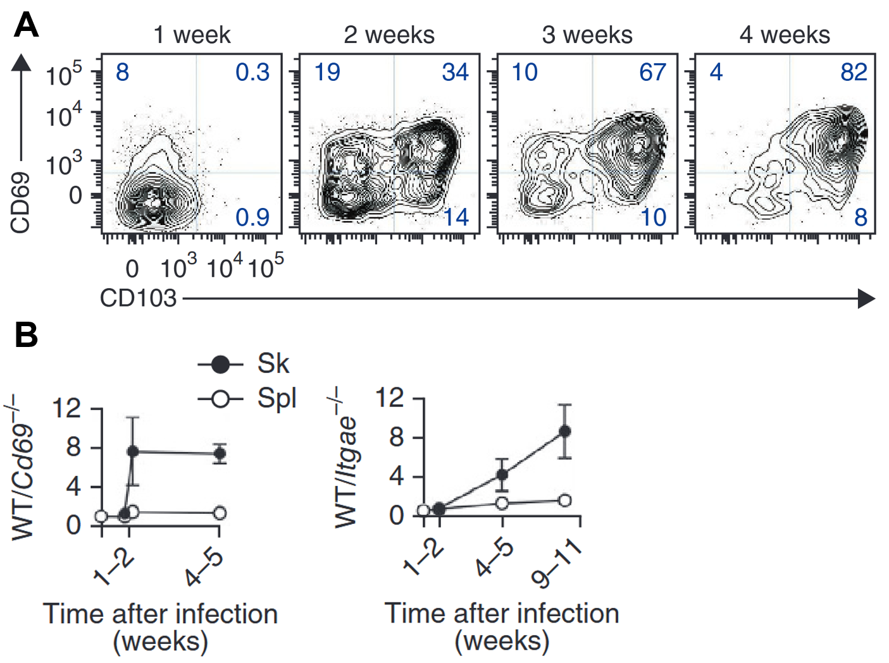

### Figure [[CD69]] [[CD103]] - Expression de [[CD69]] et [[CD103]] par les lymphocytes T résidents mémoires

*Figures adaptées de Mackay* et al *: (A) Cinétique d'expression de [[CD69]] et de [[CD103]] par les lymphocytes dans la peau après infection locale par [[HSV]]. (B) Des lymphocytes T gBT-I WT ou [[KO]] pour [[CD69]] ou [[CD103]] ont été cotransférés dans une souris naïve, puis ont été soumis à un challenge par [[HSV]], et le ratio de lymphocytes WT/KO a été représenté au cours du temps après le début du challenge* 