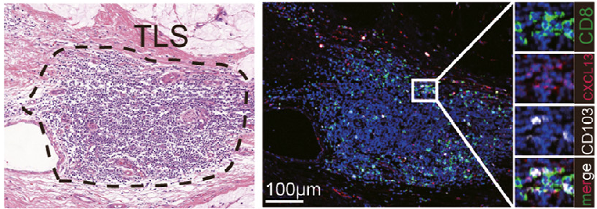

# Figure TLS - Les lymphocytes T résidents mémoires sont retrouvés dans les structures lymphoïdes tertiaires

*Figure adaptée de Hu* et al *2024 : observation par microscopie de la localisation au sein des TLS des lymphocytes T résidents mémoires dans les tumeurs de cancers gastriques*