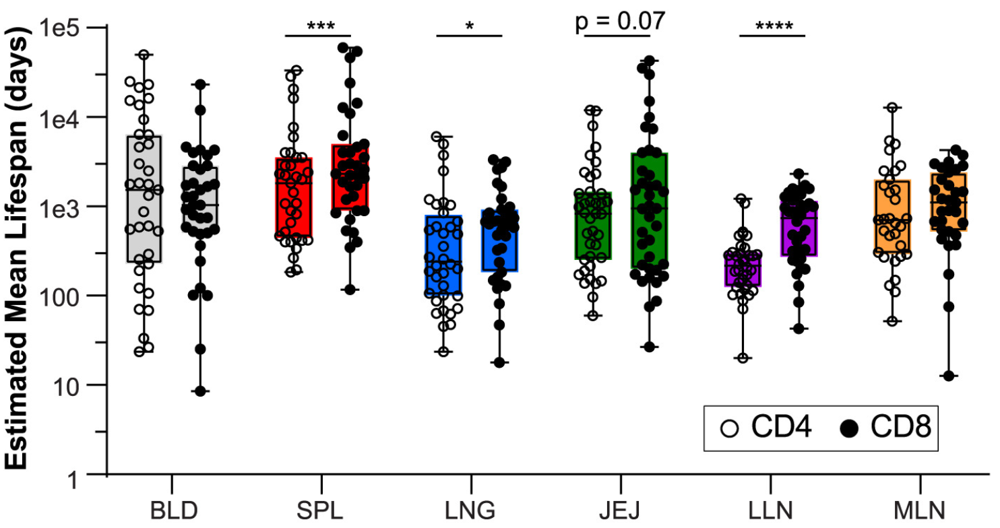

# Figure persistance - Durée de vie des lymphocytes T mémoires en fonction de leur localisation dans l'organisme

*Figure adaptée de Lam* et al *2025 : la persistance des lymphocytes T mémoires dans l'organisme a été estimée en utilisant le niveau d'expression du marqueur de prolifération Ki67*